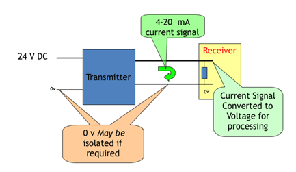
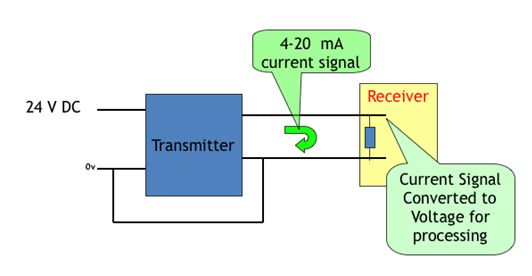
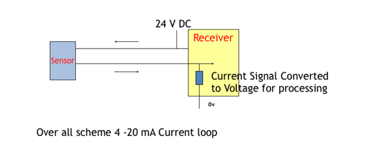
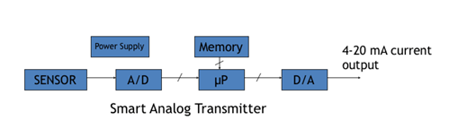

## Prerequisite
Standard Instrumentation Signal range

Transmitter is a device that translates the signal produced by a sensor into a standardised instrumentation signal either 3-15 PSI air pressure Or 4-20 mA DC electric current.

The standardized signal to sent to an indicator , a controller or both.

The standard 4 and 20 mA current transmitters are the classical analog transmitters.

## Evolution of transmitters:
* 4 wire
* 3 wire
* 2 wire
* Intelligent/SMART
* Wireless

## 4 Wire Transmitter Configuration:

## 3 Wire Transmitter Configuration:

In 3 wire/4 wire transmitters separate power supply is used to power the sensor and its signal conditioning circuits. These Power supply wires are separate from signal wires carrying 4-20 mA.

* These are also called "self powered"

Advantage: No loading effect

Disadvantage: Expensive due to requirement of more cable length

2 Wire Transmitter Configuration:

only two wires which carry power supply as well as output current signal

* These are also called as "loop powered"
* 4-20 mA current loop interface is the standard for almost all the process control instruments.
* Features
* Only two wires connect sensor (transmitter) and receiver
* DC supply voltage is nominally 24 V DC
* When process parameter is at lowest value
* Current in the loop is 4 mA
* When process parameter is at highest value
* Current in the loop is 20 mA
* 4 mA are used for powering the sensor electronics

* Advantages
* Signal transmission over long distances without signal degradation.
* Broken wire detection ( as the current would drop to zero)
* Short circuit detection ( as the current would drop to zero )
* Dead sensor detection( as the current would drop to zero )

* Low voltage and low current are safe.

* A range of improved transmitters are available in two broad categories
* smart analog transmitters
* intelligent digital transmitters

## Smart Analog Transmitters
* Main features
* Essentially 4-20 mA current output
* Transmitter has micro processor/ Microcontrollers based circuits with on chip memory

## Other Features
* Built in signal conditioning
* Linearization
* Offset adjustment
* Gain
* Arithmetic capability
* signal can be converted into engineering units for direct use
* Digital display for
* Sensor output
* Parameter setting
* Diagnostics

## Intelligent Transmitters
### Main features
* Outputs
* 4- 20 mA current output
* Digital data transmission
* Support to popular protocols like
* HART ( most popular )
* Foundation field bus
* Profibus
* Wireless ( most recent development)
* Transmitter has Microprocessor/ Microcontrollers based circuits with on chip memory.
### Other features
* Remote trouble shooting
* Two way communication digital
* Built in signal conditioning
* Linearization
* Offset adjustment
* Gain
* Arithmetic capability
* signal can be converted into engineering units for direct use
* Digital display for
* Sensor output
* Parameter setting
* Diagnostics

